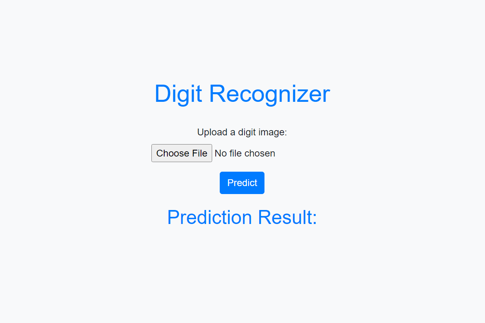

# Introduction:

This application, the Digit Recognizer, is a web-based tool designed to recognize handwritten digits using machine
learning techniques. With the advancement of deep learning and image recognition algorithms, it has become feasible to
build accurate models capable of identifying handwritten digits with high precision. My application leverages this
technology to provide users with a seamless experience for digit recognition tasks. Whether it's recognizing handwritten
digits for digitizing documents or assisting in educational activities, my application offers a user-friendly interface
for efficient digit recognition.



# Configuration:

To configure and deploy the Digit Recognizer application, follow these step-by-step instructions:

1. Set up the environment:
    - Ensure you have Python installed on your system.
    - Create a virtual environment to manage dependencies using `venv` or `conda`.

2. Install dependencies:
    - Use pip to install the required Python packages listed in the `requirements.txt` file.

3. Prepare the dataset:
    - Obtain the MNIST dataset, which contains handwritten digit images.
    - Split the dataset into training and testing sets for model training and evaluation.

4. Build the machine learning model:
    - Choose a machine learning technique, such as SVM, k-Nearest Neighbors, or a neural network.
    - Train the model using the training data and evaluate its performance using the testing data.

5. Develop the web application:
    - Use a web framework like Flask or Django to create the frontend and backend of the application.
    - Design the user interface for uploading handwritten digit images and displaying recognition results.

6. Integrate the machine learning model:
    - Incorporate the trained machine learning model into the web application to perform digit recognition.
    - Define endpoints for processing uploaded images and returning recognition results.

7. Configure the environment variables:
    - Set up environment variables for the Flask application, including the Flask secret key and any other necessary
      configurations.

8. Run the application:
    - Start the Flask server to run the web application locally or deploy it to a hosting platform for online access.

9. Test the application:
    - Upload handwritten digit images through the web interface and verify that the application accurately recognizes
      and
      displays the digits.

10. Deploy the application (optional):
    - If desired, deploy the application to a hosting service such as Heroku, AWS, or Google Cloud Platform for online
      accessibility.

# Set up the project

1. Clone the project repository:
   ```markdown
   git clone https://github.com/saranyapsmv/Digit-Recognizer.git
   ```
2. Navigate to the project directory:
   ```markdown
   cd digit_recognizer
   ```
3. Create a virtual environment (optional but recommended):
   ```markdown
   python -m venv venv
   ```
4. Activate the virtual environment:
    - On Windows:
       ```markdown
       venv\Scripts\activate
       ```
    - On macOS/Linux:
       ```markdown
       source venv/bin/activate
       ```
5. Install dependencies:
   ```markdown
   pip install -r requirements.txt
   ```
6. Run the application locally:
   - Start the Application on desktop:
      ```markdown
      python app.py
      ```
   - Start the Application on web(windows):
      ```markdown
      $env:FLASK_APP = "app.py"
      ```
      ```markdown
      set FLASK_APP=app.py
      ```
      ```markdown
      python -m flask run
      ```
   - Start the Application on web(mac/linux):
      ```markdown
      export FLASK_APP=app.py
      ```
      ```markdown
      flask run
      ```
7. Test the application:
   Upload handwritten digit images through the web interface and verify that the application accurately recognizes and
   displays the digits.

---

